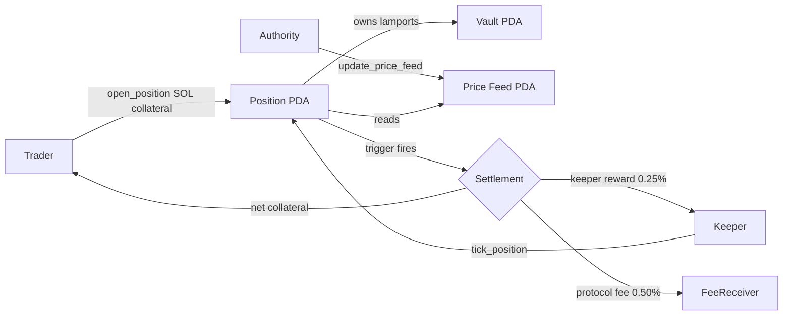

# Chalna 刹那

<p align="center">
  <a href="./LICENSE"></a>
  <a href="https://github.com/Hwaldev/chalna/actions/workflows/ci.yml"></a>
  <a href="https://github.com/Hwaldev/chalna/releases"></a>
  <a href="https://github.com/Hwaldev/chalna/commits/main"></a>
  <a href="https://github.com/Hwaldev/chalna/stargazers"></a>
  <a href="https://github.com/Hwaldev/chalna/issues"></a>
</p>

<p align="center">
  <a href="https://solana.com"></a>
  <a href="https://www.anchor-lang.com"></a>
  <a href="https://www.magicblock.gg"></a>
</p>

50ms-precision on-chain trigger engine for Solana.

Stop-loss, take-profit, and trailing-stop orders that fire from program state, not from a keeper polling an L1 RPC. Every position is a single PDA with a snapshot of its triggers and a trailing extreme. Any caller (the trader, a permissionless keeper, a MagicBlock ephemeral rollup) can submit a `tick_position` instruction. The program re-reads the configured price feed, advances the trailing extreme, evaluates the three trigger conditions, and if any fires it settles the position in the same transaction by paying the keeper, the fee receiver, and the trader.

## Features

| feature | status | notes |
| --- | --- | --- |
| stop-loss | stable | fired from on-chain feed read |
| take-profit | stable | fired from on-chain feed read |
| trailing-stop | stable | trailing extreme tracked per tick |
| permissionless keeper | stable | any signer earns the reward |
| owner manual close | stable | `cancel_position` refunds full collateral |
| native SOL collateral | stable | system-owned vault PDA per position |
| mock price feed (V0) | stable | authority-driven for development |
| Pyth pull receiver (V1) | planned | swap `update_price_feed` verify path |
| MagicBlock ER (V2) | planned | 50 ms tick cadence with delegated position |

## Program ID

| cluster | id | status |
| --- | --- | --- |
| devnet | `fSLsjTm9PGfbrAgosY2kYb1MnFEpn8LALo5cY5a4AkJ` | deployed |
| mainnet-beta | `fSLsjTm9PGfbrAgosY2kYb1MnFEpn8LALo5cY5a4AkJ` | pending |

Devnet activity: https://explorer.solana.com/address/fSLsjTm9PGfbrAgosY2kYb1MnFEpn8LALo5cY5a4AkJ?cluster=devnet

## Architecture



The PDA address of every position is `find_program_address(["position", owner, nonce_le], program_id)`. The vault is `find_program_address(["vault", position], program_id)`. Trigger evaluation reads from the on-chain `PriceFeed` directly inside `tick_position`, so the price the program sees and the price the trigger fires against are always the same value at the same slot.

## Build

```bash
git clone https://github.com/Hwaldev/chalna.git
cd chalna
anchor build
yarn install --frozen-lockfile
```

## Quick start

### Rust

```rust
use anchor_lang::prelude::Pubkey;

let owner: Pubkey = /* ... */;
let nonce: u64 = 1;

let (position, _bump) = Pubkey::find_program_address(
    &[b"position", owner.as_ref(), &nonce.to_le_bytes()],
    &chalna::ID,
);
let (vault, _vault_bump) = Pubkey::find_program_address(
    &[b"vault", position.as_ref()],
    &chalna::ID,
);
// position holds the Position account; vault holds collateral lamports
```

### TypeScript

```ts
import { AnchorProvider, BN, Program } from "@coral-xyz/anchor";
import { PublicKey } from "@solana/web3.js";
import idl from "./programs/chalna/idl/chalna.json";

const PROGRAM_ID = new PublicKey("fSLsjTm9PGfbrAgosY2kYb1MnFEpn8LALo5cY5a4AkJ");
const provider = AnchorProvider.env();
const program = new Program(idl as any, PROGRAM_ID, provider);

const nonce = new BN(Date.now());
const [position] = PublicKey.findProgramAddressSync(
  [Buffer.from("position"), provider.wallet.publicKey.toBuffer(), nonce.toBuffer("le", 8)],
  PROGRAM_ID,
);
const [vault] = PublicKey.findProgramAddressSync(
  [Buffer.from("vault"), position.toBuffer()],
  PROGRAM_ID,
);
// position: <PublicKey>, vault: <PublicKey>
```

### Push a price update

```bash
yarn ts-node scripts/push-price.ts SOL 152000000
```

The second argument is the price scaled by `10^decimals`. For a feed initialized with 6 decimals, `152000000` = $152.00.

### Run the keeper bot

```bash
yarn ts-node scripts/keeper-bot.ts 500
```

Polls every 500 ms and submits `tick_position` for every open position. This is the L1 fallback. The same loop runs inside a MagicBlock ER worker for the 50 ms cadence path.

## Trigger evaluation

For each tick, the program reads `feed.price`, advances `trailing_extreme` against the position side, then evaluates in order: stop-loss, take-profit, trailing. First hit wins. If none hit, only the trailing extreme and tick counters are updated and the position stays open.

### Long

- stop: `price <= stop_price`
- take-profit: `price >= take_profit_price`
- trailing: `price <= trailing_extreme - trailing_offset` (extreme = max seen)

### Short

- stop: `price >= stop_price`
- take-profit: `price <= take_profit_price`
- trailing: `price >= trailing_extreme + trailing_offset` (extreme = min seen)

## Fee model

| payee | source | bps |
| --- | --- | --- |
| keeper | position vault | 25 (0.25%) |
| protocol fee receiver | position vault | 50 (0.50%) |
| owner | position vault | residual |

Both bps values are admin-tunable bounded by `MAX_FEE_BPS = 500` and `MAX_KEEPER_REWARD_BPS = 200`.

## Latency comparison

| path | poll cadence | end-to-end latency (best) | end-to-end latency (worst) |
| --- | --- | --- | --- |
| L1 keeper (V0) | 500 ms | ~700 ms | ~1500 ms |
| MagicBlock ER (V2) | 50 ms | ~80 ms | ~180 ms |

The improvement comes from collapsing the off-chain poll loop into an in-rollup tick. Trigger fires inside the rollup block, settlement commits back to L1 atomically.

## Why this matters

Most on-chain stop-loss flows look like this: a keeper polls an RPC node for the latest oracle price, sees the trigger, then races to land an instruction on L1 before the price moves again. The end-to-end latency of that loop is dominated by RPC polling cadence (hundreds of ms) and L1 block inclusion (~400 ms slot). Worst case, a multi-second window separates oracle truth from settlement.

Chalna inverts the loop. Position state and trigger logic live inside a single program. Any party with access to a fresh price update can settle. When the position is delegated to MagicBlock's Ephemeral Rollup, the same `tick_position` instruction runs every ~50 ms because the rollup produces a settlement-bound state update at that cadence. Triggers fire inside the rollup's block, then commit back to L1 atomically. The 8-10x latency improvement vs L1-only keepers is the headline number; the deeper claim is that the trigger is no longer a race condition between a bot and the market.

## Project structure

```
chalna/
  Anchor.toml
  Cargo.toml
  Cargo.lock
  DEPLOY.md
  Dockerfile
  Makefile
  package.json
  rust-toolchain.toml
  tsconfig.json
  docs/
    architecture.md
    threat-model.md
    instructions.md
  examples/
    long-stop-loss.ts
    short-take-profit.ts
    trailing-stop.ts
  migrations/
    deploy.ts
  programs/chalna/
    Cargo.toml
    Xargo.toml
    README.md
    idl/chalna.json
    src/
      lib.rs
      constants.rs
      errors.rs
      events.rs
      utils.rs
      state/  config.rs  position.rs  price_feed.rs
      instructions/
        initialize_config.rs   update_config.rs
        initialize_price_feed.rs   update_price_feed.rs
        open_position.rs   update_triggers.rs
        tick_position.rs   cancel_position.rs
  scripts/
    deploy-devnet.ps1  setup-devnet.ts
    push-price.ts      keeper-bot.ts
    smoke-test.ts
  tests/
    chalna.ts
```

## Deploy (devnet)

See [DEPLOY.md](DEPLOY.md) for the full runbook. Short version:

```powershell
solana config set --url https://api.devnet.solana.com
solana balance
anchor deploy --provider.cluster devnet
yarn install --frozen-lockfile
yarn setup:devnet
```

## Versioning

- V0 (this repo): mock authority-driven feed, L1 keeper bot, deployable end-to-end on devnet today.
- V1: swap `update_price_feed` for a Pyth pull-receiver verify path. Authority keypair stays only for emergency override.
- V2: MagicBlock ER delegation. Position state is delegated by the owner, `tick_position` runs in the ER at 50 ms cadence, settlement commits back to L1.

See [ROADMAP.md](ROADMAP.md) for the full shipped list.

## Contributing

Read [CONTRIBUTING.md](CONTRIBUTING.md) before opening an issue or pull request.

## Security

Security disclosures: see [SECURITY.md](SECURITY.md).

## License

MIT, see [LICENSE](LICENSE).

## Links

- GitHub: Hwaldev/chalna
- Docs: [docs/](docs/)
- Devnet explorer: https://explorer.solana.com/address/fSLsjTm9PGfbrAgosY2kYb1MnFEpn8LALo5cY5a4AkJ?cluster=devnet
