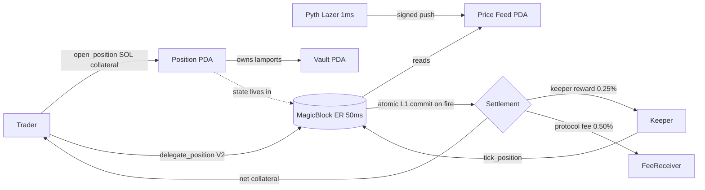

# Hwal 활

<p align="center">
  
</p>

<p align="center">
  <a href="./LICENSE"></a>
  <a href="https://github.com/Hwaldev/hwal/actions/workflows/ci.yml"></a>
  <a href="https://github.com/Hwaldev/hwal/releases"></a>
  <a href="https://github.com/Hwaldev/hwal/commits/main"></a>
  <a href="https://github.com/Hwaldev/hwal/stargazers"></a>
  <a href="https://github.com/Hwaldev/hwal/issues"></a>
</p>

<p align="center">
  <a href="https://hwal.fun"></a>
  <a href="https://hwal.fun/docs"></a>
  <a href="https://x.com/hwalfun"></a>
  <a href="https://solana.com"></a>
  <a href="https://www.anchor-lang.com"></a>
  <a href="https://www.magicblock.gg"></a>
  <a href="https://pyth.network/lazer"></a>
</p>

Sub-slot conditional execution primitive on Solana.

Stop-loss, take-profit, and trailing-stop orders that fire from program state, not from a keeper polling an L1 RPC. Every position is a single PDA with a snapshot of its triggers and a trailing extreme. Any caller (the trader, a permissionless keeper, a MagicBlock ephemeral rollup worker) can submit a `tick_position` instruction. The program re-reads the configured price feed, advances the trailing extreme, evaluates the three trigger conditions, and if any fires it settles the position in the same transaction by paying the keeper, the fee receiver, and the trader.

The interesting pairing: a Pyth Lazer 1ms channel pushed into a MagicBlock ephemeral rollup with 50ms slots collapses the trigger reflex into a single rollup block. Settlement still commits back to Solana L1 atomically. The same Anchor program works on plain L1 with a polled keeper as the fallback path.

## Features

| feature | status | notes |
| --- | --- | --- |
| stop-loss | stable | fired from on-chain feed read |
| take-profit | stable | fired from on-chain feed read |
| trailing-stop | stable | trailing extreme tracked per tick |
| permissionless keeper | stable | any signer earns the reward |
| owner manual close | stable | `cancel_position` refunds full collateral |
| native SOL collateral | stable | system-owned vault PDA per position |
| mock price feed (V0) | stable | authority-driven for development |
| Pyth Lazer verify path (V1) | planned | 1 ms channel verified on-chain into PriceFeed cache |
| MagicBlock ER delegation (V2) | planned | position delegated, tick runs in 50 ms ER slots, atomic L1 commit |

## Program ID (devnet)

`fSLsjTm9PGfbrAgosY2kYb1MnFEpn8LALo5cY5a4AkJ`

Devnet activity: https://explorer.solana.com/address/fSLsjTm9PGfbrAgosY2kYb1MnFEpn8LALo5cY5a4AkJ?cluster=devnet

## Architecture



The PDA address of every position is `find_program_address(["position", owner, nonce_le], program_id)`. The vault is `find_program_address(["vault", position], program_id)`. Trigger evaluation reads from the on-chain `PriceFeed` directly inside `tick_position`, so the price the program sees and the price the trigger fires against are always the same value at the same slot.

## Build

```bash
git clone https://github.com/Hwaldev/hwal.git
cd hwal
anchor build
yarn install --frozen-lockfile
```

## Quick start

### Rust

```rust
use anchor_lang::prelude::Pubkey;

let owner: Pubkey = /* ... */;
let nonce: u64 = 1;

let (position, _bump) = Pubkey::find_program_address(
    &[b"position", owner.as_ref(), &nonce.to_le_bytes()],
    &hwal::ID,
);
let (vault, _vault_bump) = Pubkey::find_program_address(
    &[b"vault", position.as_ref()],
    &hwal::ID,
);
// position holds the Position account; vault holds collateral lamports
```

### TypeScript

```ts
import { AnchorProvider, BN, Program } from "@coral-xyz/anchor";
import { PublicKey } from "@solana/web3.js";
import idl from "./programs/hwal/idl/hwal.json";

const PROGRAM_ID = new PublicKey("fSLsjTm9PGfbrAgosY2kYb1MnFEpn8LALo5cY5a4AkJ");
const provider = AnchorProvider.env();
const program = new Program(idl as any, PROGRAM_ID, provider);

const nonce = new BN(Date.now());
const [position] = PublicKey.findProgramAddressSync(
  [Buffer.from("position"), provider.wallet.publicKey.toBuffer(), nonce.toBuffer("le", 8)],
  PROGRAM_ID,
);
const [vault] = PublicKey.findProgramAddressSync(
  [Buffer.from("vault"), position.toBuffer()],
  PROGRAM_ID,
);
// position: <PublicKey>, vault: <PublicKey>
```

### Push a price update

```bash
yarn ts-node scripts/push-price.ts SOL 152000000
```

The second argument is the price scaled by `10^decimals`. For a feed initialized with 6 decimals, `152000000` = $152.00.

### Run the keeper bot

```bash
yarn ts-node scripts/keeper-bot.ts 500
```

Polls every 500 ms and submits `tick_position` for every open position. This is the L1 fallback. The same loop runs inside a MagicBlock ER worker for the 50 ms cadence path.

## Trigger evaluation

For each tick, the program reads `feed.price`, advances `trailing_extreme` against the position side, then evaluates in order: stop-loss, take-profit, trailing. First hit wins. If none hit, only the trailing extreme and tick counters are updated and the position stays open.

### Long

- stop: `price <= stop_price`
- take-profit: `price >= take_profit_price`
- trailing: `price <= trailing_extreme - trailing_offset` (extreme = max seen)

### Short

- stop: `price >= stop_price`
- take-profit: `price <= take_profit_price`
- trailing: `price >= trailing_extreme + trailing_offset` (extreme = min seen)

## Fee model

| payee | source | bps |
| --- | --- | --- |
| keeper | position vault | 25 (0.25%) |
| protocol fee receiver | position vault | 50 (0.50%) |
| owner | position vault | residual |

Both bps values are admin-tunable bounded by `MAX_FEE_BPS = 500` and `MAX_KEEPER_REWARD_BPS = 200`.

## Latency comparison

| path | price cadence | block cadence | end-to-end (best) | end-to-end (worst) |
| --- | --- | --- | --- | --- |
| L1 keeper, polled Pyth Core (V0) | ~400 ms | 400 ms | ~700 ms | ~1500 ms |
| L1 keeper, Pyth Lazer 1 ms (V1) | 1 ms | 400 ms | ~450 ms | ~900 ms |
| MagicBlock ER + Pyth Lazer (V2) | 1 ms | 50 ms | ~50 ms | ~120 ms |

V0 to V1 collapses the polling cadence (the off-chain keeper no longer dominates the budget). V1 to V2 collapses the block cadence (the ER block produces every 50 ms instead of every 400 ms). Both improvements are independent: Lazer alone gets you to ~450 ms, ER alone gets you to ~80 ms, the pair gets you to ~50 ms. Settlement commits to L1 atomically in every path.

## Why this matters

Most on-chain stop-loss flows look like this: a keeper polls an RPC node for the latest oracle price, sees the trigger, then races to land an instruction on L1 before the price moves again. The end-to-end latency of that loop is dominated by two things. RPC polling cadence (hundreds of ms, capped by rate limits and bot cost) and L1 block inclusion (~400 ms slot). Worst case, a multi-second window separates oracle truth from settlement.

Hwal inverts the loop. Position state and trigger logic live inside a single Anchor program. Any party with access to a fresh price update can settle. Two recently shipped pieces of Solana infrastructure remove the two remaining bottlenecks. Pyth Lazer makes the latest price available on a 1 ms channel, verifiable on-chain. MagicBlock's ephemeral rollups produce 50 ms slots with atomic L1 commit. Hwal is the trigger primitive that sits on top of both: position state delegates into the ER, Lazer pushes into the cached PriceFeed every ms, `tick_position` runs at ER cadence, and the moment a trigger fires the settlement commits back to L1 in one transaction.

The trigger stops being a race condition between an off-chain bot and the market. It becomes a deterministic state transition that happens in the same block as the price update.

## Project structure

```
hwal/
  Anchor.toml
  Cargo.toml
  Cargo.lock
  DEPLOY.md
  Dockerfile
  Makefile
  package.json
  rust-toolchain.toml
  tsconfig.json
  docs/
    architecture.md
    threat-model.md
    instructions.md
  examples/
    long-stop-loss.ts
    short-take-profit.ts
    trailing-stop.ts
  migrations/
    deploy.ts
  programs/hwal/
    Cargo.toml
    Xargo.toml
    README.md
    idl/hwal.json
    src/
      lib.rs
      constants.rs
      errors.rs
      events.rs
      utils.rs
      state/  config.rs  position.rs  price_feed.rs
      instructions/
        initialize_config.rs   update_config.rs
        initialize_price_feed.rs   update_price_feed.rs
        open_position.rs   update_triggers.rs
        tick_position.rs   cancel_position.rs
  scripts/
    deploy-devnet.ps1  setup-devnet.ts
    push-price.ts      keeper-bot.ts
    smoke-test.ts
  tests/
    hwal.ts
```

## Deploy (devnet)

See [DEPLOY.md](DEPLOY.md) for the full runbook. Short version:

```powershell
solana config set --url https://api.devnet.solana.com
solana balance
anchor deploy --provider.cluster devnet
yarn install --frozen-lockfile
yarn setup:devnet
```

## Versioning

- V0 (this repo): authority-driven price feed and L1 keeper bot. Full lifecycle deployable on devnet today. Latency floor sits at the polling cadence and the L1 slot.
- V1: Pyth Lazer verify path. New `update_price_feed_from_lazer` instruction verifies a signed Lazer message and writes into the existing PriceFeed cache. The authority keypair stays only as an emergency override. `tick_position` is untouched.
- V2: MagicBlock ER delegation. Position state delegates into the ER via `delegate_position`. `tick_position` runs inside the rollup at 50 ms cadence. On trigger, the settlement state delta commits back to L1 atomically. L1 keeper continues to work as the fallback path for undelegated positions.

See [ROADMAP.md](ROADMAP.md) for the full shipped list.

## Contributing

Read [CONTRIBUTING.md](CONTRIBUTING.md) before opening an issue or pull request.

## Security

Security disclosures: see [SECURITY.md](SECURITY.md).

## License

MIT, see [LICENSE](LICENSE).

## Links

- Website: https://hwal.fun
- Docs: https://hwal.fun/docs (also mirrored in [docs/](docs/))
- X: https://x.com/hwalfun
- GitHub: https://github.com/Hwaldev/hwal
- Devnet explorer: https://explorer.solana.com/address/fSLsjTm9PGfbrAgosY2kYb1MnFEpn8LALo5cY5a4AkJ?cluster=devnet
